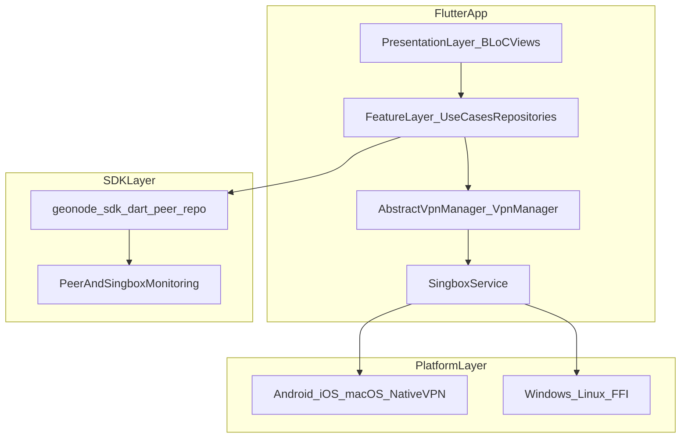

# Zenshield VPN Product Requirements Document

## Purpose and scope

Zenshield is a multi-platform VPN client built in Flutter that helps users connect to secure VPN routes, switch servers and protocols, and manage account-related flows (authentication, password reset, and agreements).  
This document describes the current product architecture and explains why each major component exists.

## Product summary

- Product: `zenshield` (`"Free VPN"` in `pubspec.yaml`).
- Platforms: Android, iOS, macOS, Windows, and Linux.
- Core model: Flutter UI and feature logic orchestrate VPN lifecycle through a unified manager, while platform-specific native services and/or FFI execute tunnel operations.

## High-level architecture

### Runtime flow at a glance

1. UI modules dispatch events through BLoCs.
2. Domain features coordinate operations (config/auth/server selection).
3. `VpnManager` owns connection lifecycle (enable/disable/status/timer).
4. `SingboxService` picks transport path:
   - Platform channels for Android/iOS/macOS.
   - FFI for Windows/Linux.
5. Native tunnel runtime reports state/statistics back via command sockets and event channels.

## Component catalog (what and why)

### 1) App entry and bootstrap

- [`/Users/mahbub/Documents/geonode/zenshield-vpn-app/lib/main.dart`](/Users/mahbub/Documents/geonode/zenshield-vpn-app/lib/main.dart)  
  Why it exists:
  - Initializes dependency injection before app startup.
  - Configures crash reporting and analytics.
  - Starts geonode SDK monitoring and desktop-specific window/startup behavior.
  - Acts as the single bootstrap boundary so platform and feature services come up in a predictable order.

### 2) Presentation layer (UI + state machines)

- [`/Users/mahbub/Documents/geonode/zenshield-vpn-app/lib/presentation/modules`](/Users/mahbub/Documents/geonode/zenshield-vpn-app/lib/presentation/modules)  
  Why it exists:
  - Encapsulates user-facing flows as modules (`home`, `servers`, `protocols`, `settings`, `auth`, `reset_password`, `logs`, `app_update`, etc.).
  - Uses BLoC and side effects to keep UI deterministic and testable.
  - Keeps screen-specific logic separate from infrastructure concerns.

- [`/Users/mahbub/Documents/geonode/zenshield-vpn-app/lib/presentation/design_system`](/Users/mahbub/Documents/geonode/zenshield-vpn-app/lib/presentation/design_system)  
  Why it exists:
  - Centralizes reusable widgets and transitions.
  - Enforces consistency across screens and reduces duplicated UI logic.

- [`/Users/mahbub/Documents/geonode/zenshield-vpn-app/lib/route/app_router.dart`](/Users/mahbub/Documents/geonode/zenshield-vpn-app/lib/route/app_router.dart)  
  Why it exists:
  - Provides a single route generation point.
  - Applies platform-appropriate navigation behavior (Cupertino routes on iOS, fade transitions elsewhere).

### 3) Feature and domain layer

- [`/Users/mahbub/Documents/geonode/zenshield-vpn-app/lib/features`](/Users/mahbub/Documents/geonode/zenshield-vpn-app/lib/features)  
  Why it exists:
  - Organizes business capabilities by domain instead of UI location.
  - Core domains include:
    - VPN lifecycle: `vpn_connection`, `singbox`, `vpn_config`, `connection`.
    - Network selection: `servers`, `region_checker`, `network_monitor`.
    - Account and access: `auth`, `agreements`, `deep_links`.
    - Product reliability and growth: `app_version`, `android_updater`, `desktop_updater`, `user_feedback`, `rating`, `launch`.

- [`/Users/mahbub/Documents/geonode/zenshield-vpn-app/lib/features/vpn_connection/vpn_manager.dart`](/Users/mahbub/Documents/geonode/zenshield-vpn-app/lib/features/vpn_connection/vpn_manager.dart)  
  Why it exists:
  - Serves as the main VPN lifecycle coordinator.
  - Starts/stops VPN, subscribes to status/stats streams, and manages timer behavior.
  - Publishes connection-state changes to the app event bus so UI and features react consistently.

- [`/Users/mahbub/Documents/geonode/zenshield-vpn-app/lib/features/singbox/singbox_service.dart`](/Users/mahbub/Documents/geonode/zenshield-vpn-app/lib/features/singbox/singbox_service.dart)  
  Why it exists:
  - Defines the abstraction for VPN tunnel runtime integration.
  - Hides platform differences behind a common interface (`init`, `start`, `stop`, status streams, diagnostics).

- [`/Users/mahbub/Documents/geonode/zenshield-vpn-app/lib/features/singbox/platform_singbox_service.dart`](/Users/mahbub/Documents/geonode/zenshield-vpn-app/lib/features/singbox/platform_singbox_service.dart)  
  Why it exists:
  - Implements the native-channel path for Android/iOS/macOS.
  - Bridges Flutter to native VPN services using method and event channels.

- [`/Users/mahbub/Documents/geonode/zenshield-vpn-app/lib/features/singbox/ffi_singbox_service.dart`](/Users/mahbub/Documents/geonode/zenshield-vpn-app/lib/features/singbox/ffi_singbox_service.dart)  
  Why it exists:
  - Implements the desktop/runtime path where direct FFI control is used.
  - Starts/stops tunnel core and wires command clients to status/stat streams.

- [`/Users/mahbub/Documents/geonode/zenshield-vpn-app/lib/features/singbox/command_client`](/Users/mahbub/Documents/geonode/zenshield-vpn-app/lib/features/singbox/command_client)  
  Why it exists:
  - Standardizes communication with command sockets (`command.sock`) for telemetry and control.
  - Isolates socket protocol details from higher-level feature code.

### 4) Cross-cutting infrastructure

- [`/Users/mahbub/Documents/geonode/zenshield-vpn-app/lib/core`](/Users/mahbub/Documents/geonode/zenshield-vpn-app/lib/core)  
  Why it exists:
  - Hosts shared infrastructure: constants, interceptors, preferences, secure-storage keys, managers, and utility mapping logic.
  - Prevents feature modules from reimplementing common mechanics.

- [`/Users/mahbub/Documents/geonode/zenshield-vpn-app/lib/di/injection_container.dart`](/Users/mahbub/Documents/geonode/zenshield-vpn-app/lib/di/injection_container.dart)  
  Why it exists:
  - Centralizes all service wiring (`get_it` + `injectable`).
  - Resolves platform-specific implementations (for Singbox service, updater, review requester) in one place.
  - Improves startup determinism and testability by making dependencies explicit.

### 5) Native platform components

- [`/Users/mahbub/Documents/geonode/zenshield-vpn-app/android/app/src/main/kotlin/com/zenshield/vpn/bg`](/Users/mahbub/Documents/geonode/zenshield-vpn-app/android/app/src/main/kotlin/com/zenshield/vpn/bg)  
  Why it exists:
  - Implements Android tunnel runtime (`VPNService`, `BoxService`), foreground behavior, notifications, and network monitoring.
  - Owns lower-level Android lifecycle and system integration required by the OS.

- [`/Users/mahbub/Documents/geonode/zenshield-vpn-app/android/app/src/main/kotlin/com/zenshield/vpn/handlers/MethodHandler.kt`](/Users/mahbub/Documents/geonode/zenshield-vpn-app/android/app/src/main/kotlin/com/zenshield/vpn/handlers/MethodHandler.kt)  
  Why it exists:
  - Bridges Flutter method calls to Android native actions.
  - Keeps channel contract logic separate from service runtime code.

- [`/Users/mahbub/Documents/geonode/zenshield-vpn-app/ios/Runner/VPN/VPNManager.swift`](/Users/mahbub/Documents/geonode/zenshield-vpn-app/ios/Runner/VPN/VPNManager.swift)  
  Why it exists:
  - Uses `NETunnelProviderManager` to configure and start/stop Apple VPN tunnels.
  - Encapsulates NetworkExtension setup and preference management for iOS/macOS flows.

### 6) Embedded packages

- [`/Users/mahbub/Documents/geonode/zenshield-vpn-app/geonode_sdk`](/Users/mahbub/Documents/geonode/zenshield-vpn-app/geonode_sdk) (published in app as `dart_peer_repo`)  
  Why it exists:
  - Provides P2P and SOCKS-related SDK capabilities used by the app.
  - Includes monitoring helpers such as sing-box readiness checks used during startup/connection flows.

- [`/Users/mahbub/Documents/geonode/zenshield-vpn-app/packages/desktop_updater`](/Users/mahbub/Documents/geonode/zenshield-vpn-app/packages/desktop_updater)  
  Why it exists:
  - Supplies desktop update orchestration and UI integration as a separate reusable package.

### 7) Observability and quality systems

- Firebase (`core + crash reporting`), Talker logs, and analytics managers are initialized in app bootstrap to provide:
  - Crash visibility.
  - Runtime diagnostics.
  - Usage analytics.
  - Faster production issue triage.

## Key user flows (high-level)

### Connect to VPN

1. User taps connect in UI module.
2. BLoC dispatches action to VPN domain.
3. `VpnManager.enableVpn` loads config and starts `SingboxService`.
4. Native/FFI tunnel starts.
5. Status events map to app connection states and update UI + timers.

### Switch server

1. User selects server/protocol.
2. Domain updates config and may preserve timer during transition.
3. Tunnel restarts through Singbox abstraction.
4. Event bus publishes switched/connected state to UI modules.

### Authentication and account recovery

1. Auth modules call auth features/repositories.
2. Tokens/session data are persisted with secure storage/preferences.
3. Password recovery and inbox verification modules complete account recovery loop.

### App update and platform utilities

1. Version/update features check availability.
2. Android and desktop updater implementations are selected by DI.
3. UI modules display update requirement/availability and trigger platform-specific execution.

## External dependencies and integrations

- Backend APIs accessed through `Dio` and auth interceptors.
- Native OS VPN APIs:
  - Android VPN services.
  - Apple NetworkExtension (`NETunnelProviderManager`).
- Analytics/telemetry: Firebase, Talker, and integrated analytics providers.
- Localized strings generated under `lib/l10n`.

## Out of scope and assumptions

- This PRD documents current architecture and component rationale.
- It does not redefine product roadmap, legal policy text, or marketing positioning.
- Detailed low-level protocol internals are intentionally abstracted unless needed for architecture clarity.
